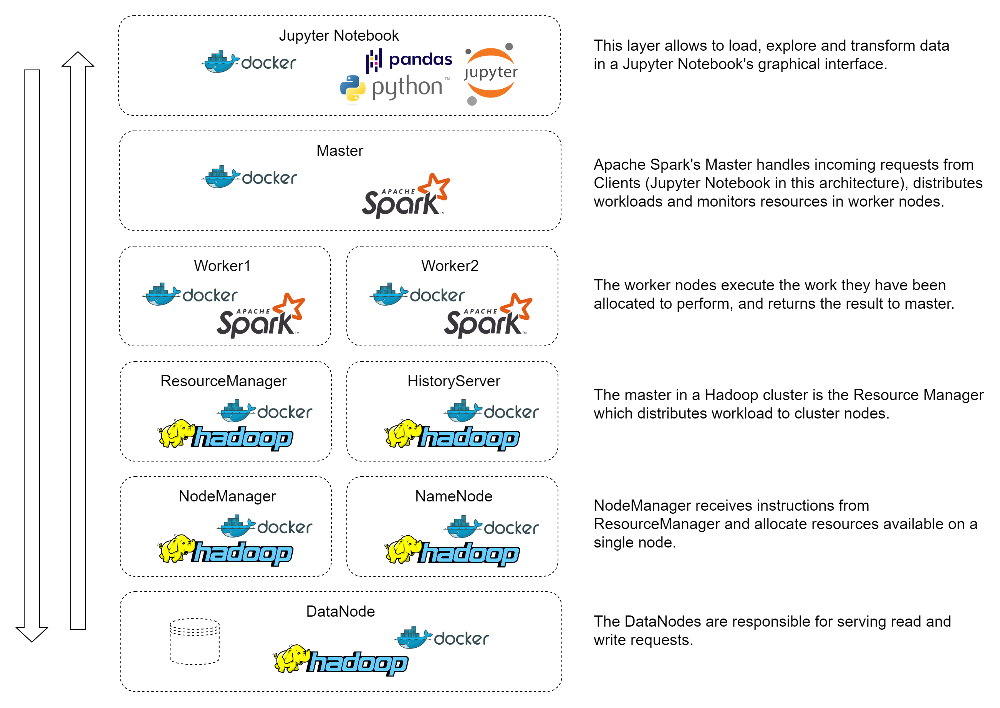
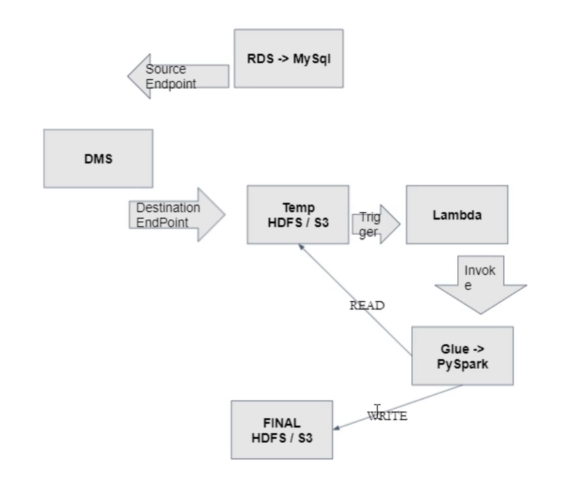

# Pyspark Tutorial and Simple Pipeline with AWS

<!-- ABOUT THE SETUP -->
## About The Setup

Purpose for this tutorial is to show how to get started with Hadoop, Spark and Jupyter for your BigData solution, deploy as Docker Containers.

## Pre-requisite
- Ensure Docker is installed.

## Start

Execute `bash master-build.sh` to start the the build and start the containers.

### Hadoop
Access Hadoop UI on ' http://localhost:9870 '

### Spark
Access Spark Master UI on ' http://localhost:8080 '

### Jupyter
Access Jupyter UI on ' http://localhost:8888 '

## Hand on
`Now you can run notebook for start with tutorial pyspark`

----------------------------------------------------------------

<!-- ABOUT THE PROJECT -->
## About The Project

We will create simple pipeline with some services in AWS

## Service

+ RDS: Relationship database service - stores the data 
+ DMS: Database migration service - migrate data from RDS to S3 storage service
+ S3: Storage in cloud
+ Lambda: Lambda service - create function trigger
+ Glue: Glue service - will work when called from lambda

## Activity flow description

1. Data will be stored in RDS
2. Any changes on the RDS will be stored by DMS as a file in an S3 service
3. When there is a file stored on S3 will trigger lambda service
4. Lambda service will invoke and trigger Glue
5. Glue will read the file stored in S3 - the temporary storage area and make the changes and archive to a new file on the destination S3

`data for RDS can be used file Dump.txt to create record`